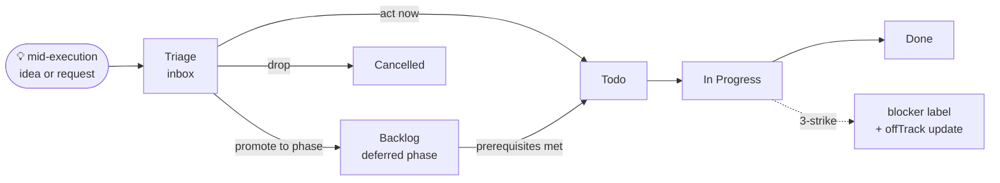

# planning-with-linear

A Claude Code skill that plans and tracks complex tasks using **Linear** as external memory: a Linear *Project* per task, an *Issue* per phase, a linked *Document* for findings, and *Status Updates* for the session log.

This is a fork of [OthmanAdi/planning-with-files](https://github.com/OthmanAdi/planning-with-files) (Manus-style file-based planning). The same context-engineering principles apply — only the storage backend changed from local markdown files to Linear's API.

[](.claude-plugin/plugin.json)
[](LICENSE)

---

## What changed vs `planning-with-files`

| Concept | `planning-with-files` (original) | `planning-with-linear` (this fork) |
|---|---|---|
| Goal | `task_plan.md` | Linear Project description |
| Phases | Headings in `task_plan.md` | Issues with the `phase` label, native workflow state |
| Findings | `findings.md` | Linear Document linked to the project |
| Session log | `progress.md` | Project Status Updates (`onTrack` / `atRisk` / `offTrack`) |
| Errors | "Errors Encountered" table | Comments on the active phase issue + `error` label |
| Pointer | `.planning/.active_plan` | `.planning/.active_linear` (cached project ID + phase summary) |
| SHA-256 attestation | yes | dropped (different threat model — see `reference.md`) |
| Multi-IDE mirrors / localization | 17+ IDEs, 5 languages | English + Claude Code only |

Why Linear? Native workflow states (Todo / In Progress / Done) replace markdown checkboxes; status updates with a `health` field replace the progress table; comments thread under the issue they describe; and the whole plan is shareable with teammates and other agents without filesystem sync.

---

## Prerequisites

A Linear MCP server registered with your harness, exposing the standard `mcp__linear__*` tools (`list_teams`, `save_project`, `save_issue`, `save_document`, `save_status_update`, `save_comment`, `list_issue_statuses`, `create_issue_label`, …).

See [Linear's MCP guide](https://linear.app/docs/mcp).

---

## Install

```
/plugin marketplace add identity16/planning-with-linear
/plugin install planning-with-linear@planning-with-linear
```

Or use as a local plugin by cloning this repo into your Claude Code plugins directory.

---

## Slash commands

| Command | What it does |
|---|---|
| `/plan` | Start a new Linear-backed plan: pick a team, create the Project + phase Issues + Findings Document + kickoff Status Update. |
| `/start` | Resume an existing plan — re-fetches the project from Linear and orients to the active phase. |
| `/status` | Show project URL, phase issues with current workflow states, recent status updates, error/blocker counts. |
| `/sync` | Re-fetch the project from Linear and refresh `.planning/.active_linear`'s cache. |

---

## How it works

When you run `/plan`:

1. The skill calls `mcp__linear__list_teams` and asks which team to use.
2. It caches the team's actual workflow state names (e.g. "Backlog / Todo / In Progress / Done") — Linear teams can rename their states, so this is fetched, not hardcoded.
3. It ensures the canonical labels exist: `phase`, `error`, `decision`, `blocker`. Missing ones are created with `mcp__linear__create_issue_label`.
4. It creates the **Project**, one **Issue** per phase (first phase In Progress, the rest Todo), the **Findings Document**, and the kickoff **Status Update**.
5. It writes `.planning/.active_linear` with the project ID, URL, team, document ID, cached state names, and a phase summary.

The model then works phase by phase, calling `save_comment` to log details, transitioning issue states as it goes, and posting Status Updates at session start, phase transitions, and session end. Errors follow a 3-strike protocol with `error`/`blocker` labels.

---

## Triage / Backlog flow

The skill leans on two Linear states that aren't part of the active phase pipeline:

- **Triage** — an inbox for ad-hoc ideas, requests, or discoveries that surface mid-execution but aren't yet a phase. Captured fast with `save_issue(state=Triage)` so they don't pollute the active phase, then sorted at the next phase boundary.
- **Backlog** — phases that are planned but not yet ready to start (waiting on a prior phase, post-MVP stretch work, deferred follow-ups). Phase issues can live in `Backlog` until prerequisites are met, then graduate to `Todo`.



The active phase pipeline is still `Todo → In Progress → Done`; Triage and Backlog are upstream holding areas so the pipeline stays focused.

---

## Hooks

The skill registers four hooks. None of them inject Linear *content* into the model — they only read the local cache file. This intentionally closes the prompt-injection surface that hash attestation existed to mitigate in the original skill.

| Hook | What it emits |
|---|---|
| `UserPromptSubmit` | Cached project URL + active phase + "re-fetch with `get_project` for fresh state" reminder. |
| `PreToolUse` | Same, shorter (one line). |
| `PostToolUse` | Reminder to transition the issue if a phase finished, log discoveries via `save_comment`. |
| `Stop` | Cached completion count ("X/N phases complete, may be stale, run /sync"). |

---

## Repository layout

```
skills/planning-with-linear/
├── SKILL.md                   ← entry point + hook config + critical rules
├── reference.md               ← mapping table, label conventions, security boundary, adapted Manus principles
├── examples.md                ← four worked examples in MCP-call form
├── templates/                 ← markdown bodies passed into save_* MCP calls
│   ├── project-description.md
│   ├── phase-issue-body.md
│   ├── findings-document.md
│   ├── status-update-body.md
│   └── error-comment.md
└── scripts/                   ← local-only helpers (no Linear calls)
    ├── init-linear.sh           — pre-flight + double-init guard
    ├── set-active-linear.sh     — write/clear/show .planning/.active_linear
    ├── resolve-active-linear.sh — hook output (cached pointer + reminder)
    ├── check-linear-complete.sh — Stop-hook completion summary
    └── linear-catchup.sh        — git-log vs last_synced_at drift detector

commands/
├── plan.md       /plan
├── start.md      /start
├── status.md     /status
└── sync.md       /sync
```

The `.planning/.active_linear` schema is documented in [`skills/planning-with-linear/reference.md`](skills/planning-with-linear/reference.md).

---

## Out of scope

This skill uses Linear strictly as external memory. It does **not** use Cycles, Initiatives, Customers, Customer Needs, Attachments, Diffs, or `save_issue.delegate`. It does **not** mirror to other IDEs (`.codex`, `.cursor`, …) or ship localization variants. PowerShell scripts are not provided. See [`reference.md`](skills/planning-with-linear/reference.md#out-of-scope) for the full list and rationale.

---

## Migration from `planning-with-files`

See [MIGRATION.md](MIGRATION.md).

---

## Credits

Forked from [OthmanAdi/planning-with-files](https://github.com/OthmanAdi/planning-with-files) at v2.37.0. The Manus context-engineering pattern (filesystem as external memory, recitation, error persistence) is preserved verbatim — only the storage layer is different. Original authors and contributors are credited in [CONTRIBUTORS.md](CONTRIBUTORS.md).

## License

MIT — see [LICENSE](LICENSE).
